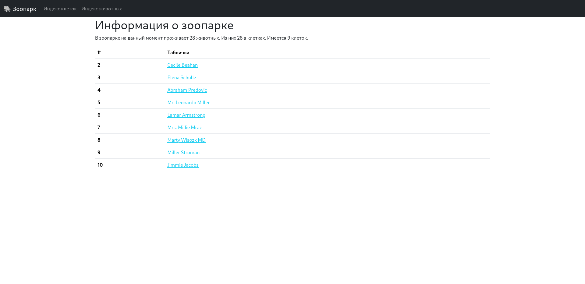

# Тестовое задание

## Веб-приложение для управления зоопарком

### Основные функции

#### Клетки
- [x] Создание: Пользователь может добавить новую клетку, где будут расположены животные, указав «табличку» и вместимость клетки.
- [x] Удаление: Пользователь может удалить клетку для животного (если в клетке уже кто-то проживает, то удаление возможно только после того, как всех животных переселят)
- [x] Изменение: Пользователь может изменить клетку (Если в клетке уже кто-то проживает, то новый размер клетки, не должен быть меньше количества проживающих в ней животных)
- [x] Просмотр: Пользователь может просмотреть клетку с животными, где будут отображены все проживаемые в ней животные.
- [x] Каждая клетка имеет название и вместимость
#### Животные
- [x] Создание: Пользователь может добавить новое животное, указав вид, имя, возраст, описание, а также клетку в которой проживает данное животное (при условии, что место в клетке есть).  
- [x] Получение: Пользователь может просмотреть информацию о конкретном животном на отдельной странице.
- [x] Удаление: Пользователь может удалить животное из зоопарка.
- [x] Изменение: Изменение информации о животном
#### Требования к реализации
- [x] Использование Laravel 5 или более поздней версии. (используется Laravel 11)
- [x] Использование MySQL. (используется MySQL 8)
- [x] Приложение для развертывания приложения выбирается по желанию (используется LAMP завернутый в Docker).
- [x] На каждой странице должны быть ссылки для перехода на другие страницы.
- [x] Использование миграций для создания таблиц базы данных.
- [x] Использование Eloquent ORM для взаимодействия с базой данных
- [x] Использование Blade шаблонов для вёрстки страниц.
- [x] Готовое приложение должно быть полностью рабочим, должны отсутствовать исключения, запросы выполняться корректно, а результат их работы ожидаемым.

### Дополнительные задания
- [x] Использование Bootstrap для стилизации.
- [x] Создание интерактивного дизайна с помощью JS, Jquery, CSS или Bootstrap.
- [x] Добавить возможность пользователям устанавливать изображение для животного, а также просматривать его на странице выбранного животного.
- [x] Вывод на главной странице статистики по проживающих в зоопарке животных. (например «В зоопарке на данный момент проживают N животных»).
- [x] Авторизация пользователей (логин admin, пароль password)

### Запуск
Для начала нужно установить Docker и Docker Compose. После установки необходимых зависимостей и настройки переменных окружения запускается с помощью Laravel Sail:
```shell
./vendor/bin/sail up
```
Потом нужно создать базу данных с помощью миграции.
```shell 
./vendor/bin/sail artisan migrate:fresh
```
И заполнить её тестовыми данными.
```shell
./vendor/bin/sail artisan db:seed
```
### Скриншоты

#### Не авторизован


#### Авторизован


### Демонстрация работы

#### Демка
[Запись](./demo/videos/demo.mp4)

#### Деплой на RailWay (не работает из-за ограничений после санкций)
https://ahead-laravel-zoo-production.up.railway.app

#### Репозиторий на GitHub
https://github.com/ae6b3e77fd3ff2765aa254f7e7d5cf0a/ahead-laravel-zoo
